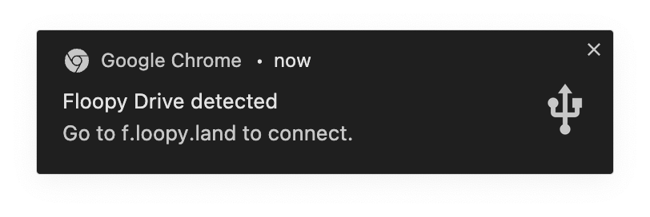
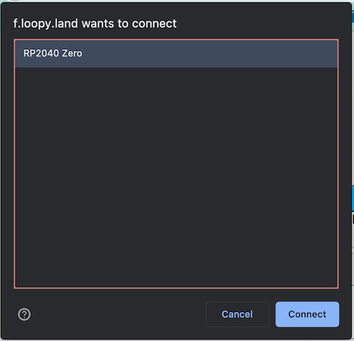
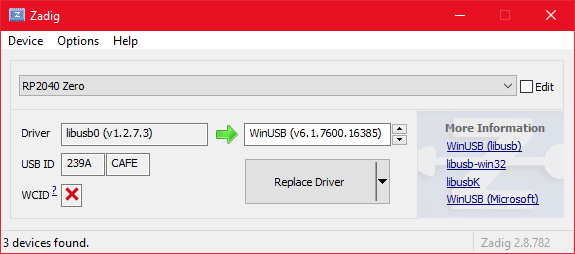

# Floopy Drive User Guide

Unlike many flash carts, the Floopy Drive doesn't have an SD card or a menu that runs on the Loopy itself. You'll use your computer to flash games to it. This will show you how!

# Getting Started

You'll need:

* Floopy Drive
* A computer with a USB port
* A USB-C cable (C-to-C or A-to-C, whatever works with your computer)
* Chrome or another browser that [supports WebUSB](https://caniuse.com/webusb)

Plug the Floopy Drive into a free port on your computer. If Chrome is running, you should get a notification that says "Floopy Drive detected." 

Tapping this will navigate you to the web interface at [f.loopy.land](https://f.loopy.land). 

Tap the "Connect" button on the page.

You'll get another Chrome dialog letting you choose which device to pair to:

Select the "Floopy Drive" and tap "Connect." Your Floopy Drive is now paired and ready to go!

## Windows Users

Unfortunately, the default drivers on Windows aren't suitable for WebUSB. If you don't see the notification above when plugging in the Floopy Drive with Chrome already open, try updating the drivers:

Please download the latest [Zadig](https://zadig.akeo.ie/).

Connect the Floopy Drive and run Zadig.

Click "Options > List All Devices" and the device selection pulldown should have a few options. Click the "Floopy Drive" in this list to select the Floopy Drive.

By default, Zadig should show options to update the driver (most likely *from* "libusb0") *to* "WinUSB". This default is exactly what you want, no twiddling required. With "WinUSB" selected on the right side, tap "Replace Driver." Be patient, installation can take up to a minute.

Once it's done running, Chrome will detect the Floopy Drive right away, no need to unplug the device.

## After Initial Pairing

Chrome will remember your pairing, so in the future, all you have to do is plug in the Floopy Drive and tap the "Floopy Drive detected" notification.

## Disconnecting

It should be perfectly safe to pull out the USB after you are done using the Floopy Drive. As long as it's idle, you don't have to close the browser window or hit the disconnect button, but you certainly can.

## Battery

The Floopy Drive uses a CR2032 battery to keep your saves alive. If you are losing saves, please open the Floopy Drive and replace the battery.

(No data are available yet regarding the lifespan of the battery.)

# Using the Floopy Drive

On the Floopy Drive page, just drag a Loopy ROM into the indicated area and it'll flash the game.

Saves are automatically backed up whenever you plug in the drive. When you switch back to a game you were playing before, your old save will be there waiting for you.

## ROMS

The preferred ROM set for the Floopy Drive is called "CASIO LOOPY ROMS COMPLETE SET [verified 2023]". These are all confirmed working with the Floopy Drive.

**NOTE** ROMs in big-endian are expected by the Floopy Drive, however, if you use a little-endian ROM, we will try to detect this and swap the bytes for you transparently. So other ROM sets should work too.

## Saves

Saves are tested to be compatible with [Loopy My Seal Emulator](https://github.com/PSI-Rockin/LoopyMSE) and MAME.

# Updating Firmware

The Floopy Drive site will alert you if a newer version of firmware is available. To upgrade:

* Grab the latest firmware by tapping the link provided
* Insert a pin/paperclip into the hole in the rear of the cart. You should feel a tactile button at the bottom of it
* Plug the Floopy Drive in while the button is held down
* If done properly, a USB drive called "RPI-RP2" will appear
* Copy the downloaded `pico.ino.uf2` file to the drive
* That's all! The Floopy Drive will automatically reboot and reconnect.

# Advanced Mode

An advanced mode is available on the Floopy Land flasher. Check Advanced to use this interface. 

An understanding of the Floopy Drive's internals will help. The Floopy Drive has:

* Flash - this stores the game / ROM. There are 4MB available.
  * It *must* be erased between writes.
  * You can erase the first 2MB, or all 4 MB. So if you're flashing a 2MB game, you don't really need to erase all 4MB.
* SRAM - this stores save games. There are 128KB available. It can be overwritten without erasing.
  * It's a good idea to erase the SRAM when flashing a new game. A few games might get confused if the contents of SRAM are not what it expect.
* The Pico filesystem - the RP2040 has onboard flash that can be used to backup and restore your saves when swapping between games

## Functions

* Inspect - dumps a bunch of very useful information to the log, including excerpts of the RAM and ROM
* ROM / Dump - dumps the entire ROM for verification purposes
* ROM / Erase 2MB - erases the first 2MB of the flash storage. Use this before flashing a 2MB game.
* ROM / Full Erase - erases the first 2MB, then the second 2MB of the flash storage. Use this before flashing a 3MB game.
* ROM / Choose File - either choose a Loopy ROM here, or drag and drop a ROM onto it. See below for more on ROMs. Flashing will begin as soon as you choose a file.
* SRAM / Download - dumps the contents of SRAM, or in other words, downloads your save. Useful for copying saves between carts and/or emulators!
* SRAM / Format - clears every byte of the SRAM. Do this if this is the first time you're playing a game. Not necessary if you're going to be restoring or uploading a save.
* SRAM / Backup - backs up the current game's save file to the Pico flash. Again this is stored on your cart. Do this *before* switching from your existing game to a new game.
* SRAM / Restore - if it can find a backed up save for the current game, loads it from the Pico flash. Do this *after* switching to a new game that you've previously played on your Floopy Drive.
* SRAM / Choose File - either choose a Loopy save file here, or drag and drop a save onto it. See below for more on Saves. Writing will begin as soon as you choose a file.
* DEVICE / Set Nickname - add your name to personalize your Floopy Drive just like PC Collection! The device name will be updated the next time you plug it in.

## Typical Operation

Say you want to change the game on your Floopy Drive from OldGame to NewGame. The typical steps would be:

1. Erase 2MB (assuming NewGame is 2MB) or Full Erase (if NewGame is 3MB)
2. ROM / Choose File and select NewGame.bin
3. SRAM / Restore if you've played it before on the Floopy Drive

Note that you don't need to backup the SRAM manually since that's done every time you plug in the Floopy Drive.

